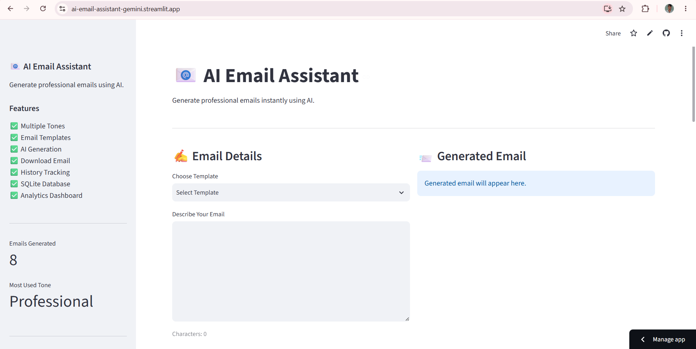
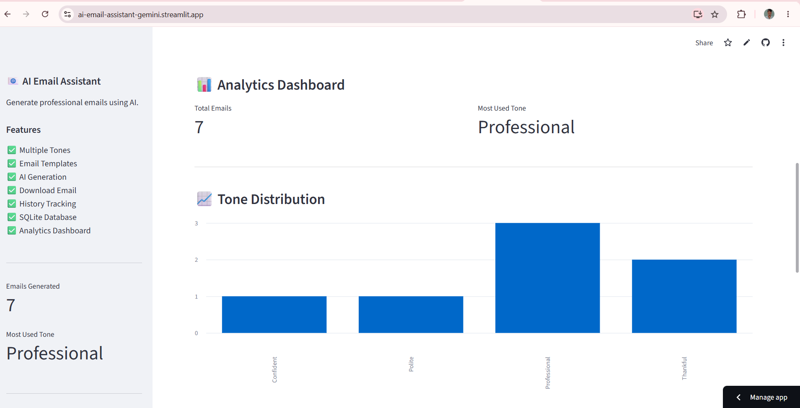
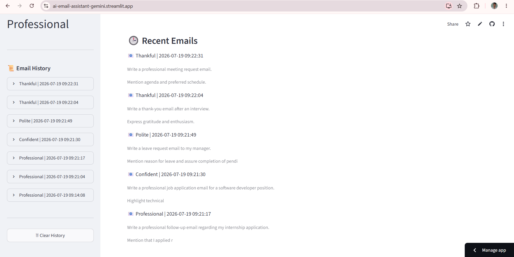

# 📧 AI Email Assistant

An AI-powered Email Generation Platform built using **Streamlit, FastAPI, Google Gemini AI, and SQLite**. This application helps users generate professional emails in different tones, manage email history, and view usage analytics through an intuitive dashboard.

---

# 🚀 Live Demo

### Frontend (Streamlit)

https://ai-email-assistant-gemini.streamlit.app/

### Backend API (FastAPI + Render)

https://ai-email-assistant-7ged.onrender.com

### API Documentation (Swagger)

https://ai-email-assistant-7ged.onrender.com/docs

---

# 📌 Project Overview

AI Email Assistant is a full-stack AI application that automates professional email writing using Google's Gemini AI model.

Users simply provide a description of the email they want to write, choose a preferred tone, and the system generates a complete ready-to-send email.

The application also stores generated emails in SQLite and provides analytics such as total emails generated, tone usage statistics, and recent email activity.

---

# ✨ Features

## AI Email Generation

* Generates complete professional emails
* Uses Google Gemini AI
* Ready-to-send output


## 📸 Application Screenshots

### Home Page



---

### Email Generation


---

### Analytics Dashboard



---

### History Tracking



## Multiple Email Tones

Supported tones:

* Professional
* Formal
* Friendly
* Polite
* Confident
* Apologetic
* Thankful
* Persuasive

## Email Templates

Pre-built templates for common business scenarios.

## Download Generated Emails

Users can download generated emails as text files.

## Email History Tracking

Stores generated emails with timestamps.

## SQLite Database

Persistent local database storage.

## Analytics Dashboard

Provides:

* Total Emails Generated
* Most Used Tone
* Tone Distribution
* Recent Email Activity

## API-Based Architecture

Frontend and backend are separated using REST APIs.

---

# 🛠️ Technology Stack

## Frontend

* Streamlit

## Backend

* FastAPI
* Uvicorn

## Database

* SQLite

## AI Model

* Google Gemini 2.5 Flash

## Programming Language

* Python

## Deployment

* Streamlit Community Cloud
* Render

---

# 📂 Project Structure

```text
AI_Email_Assistant/

├── api/
│   └── main.py

├── services/
│   └── email_generator.py

├── database/
│   ├── db.py
│   └── analytics.py

├── app.py

├── config.py

├── requirements.txt

├── README.md

└── .gitignore
```

---

# ⚙️ System Architecture

```text
User
  │
  ▼
Streamlit Frontend
  │
  ▼
FastAPI Backend
  │
  ▼
Google Gemini API
  │
  ▼
Generated Email
  │
  ▼
SQLite Database
  │
  ▼
Analytics Dashboard
```

---

# 🗄️ Database Design

The application stores:

| Field           | Description        |
| --------------- | ------------------ |
| id              | Unique Email ID    |
| prompt          | User Input         |
| tone            | Selected Tone      |
| generated_email | AI Generated Email |
| created_at      | Timestamp          |

---

# 📊 Dashboard Analytics

The analytics module provides:

### Total Emails Generated

Tracks the number of emails generated.

### Most Used Tone

Identifies the most frequently selected tone.

### Tone Distribution

Displays usage frequency of each tone.

### Recent Emails

Shows recently generated emails.

---

# 🔌 API Endpoints

## Health Check

GET /

Response:

```json
{
  "message": "AI Email Assistant API Running"
}
```

## Generate Email

POST /generate

Request:

```json
{
  "prompt": "Write a professional leave request email",
  "tone": "Professional"
}
```

Response:

```json
{
  "status": "success",
  "generated_email": "Generated Email Content"
}
```

---

# 🚀 Installation

## Clone Repository

```bash
git clone https://github.com/ravikiranediga/AI_Email_Assistant.git
```

```bash
cd AI_Email_Assistant
```

## Create Virtual Environment

```bash
python -m venv venv
```

## Activate Virtual Environment

Windows:

```bash
venv\Scripts\activate
```

## Install Dependencies

```bash
pip install -r requirements.txt
```

## Configure Environment Variable

Create a .env file:

```env
GEMINI_API_KEY=YOUR_GEMINI_API_KEY
```

---

# ▶️ Run Backend

```bash
uvicorn api.main:app --reload
```

Backend:

```text
http://127.0.0.1:8000
```

Swagger Docs:

```text
http://127.0.0.1:8000/docs
```

---

# ▶️ Run Frontend

```bash
streamlit run app.py
```

Frontend:

```text
http://localhost:8501
```

---

# 🎯 Learning Outcomes

Through this project:

* Built a Full-Stack AI Application
* Integrated Google Gemini API
* Developed REST APIs using FastAPI
* Implemented SQLite Database Operations
* Created Interactive Streamlit UI
* Designed Analytics Dashboard
* Deployed Production Applications
* Learned Cloud Deployment using Render and Streamlit Cloud

---

# 🔮 Future Enhancements

* User Authentication
* PostgreSQL Integration
* Gmail Integration
* PDF Export
* Email Categorization
* Multi-Language Email Generation
* User Profiles
* Cloud Database Storage

---

# 👨‍💻 Author

**E Ravi Kiran**

B.Tech – Computer Science (AI)

Sri Venkatesa Perumal College of Engineering

GitHub: https://github.com/ravikiranediga

---

# ⭐ Project Highlights

* Full Stack AI Project
* Gemini AI Integration
* FastAPI Backend
* Streamlit Frontend
* SQLite Database
* Analytics Dashboard
* Cloud Deployment
* REST API Architecture
* Production Ready Workflow
